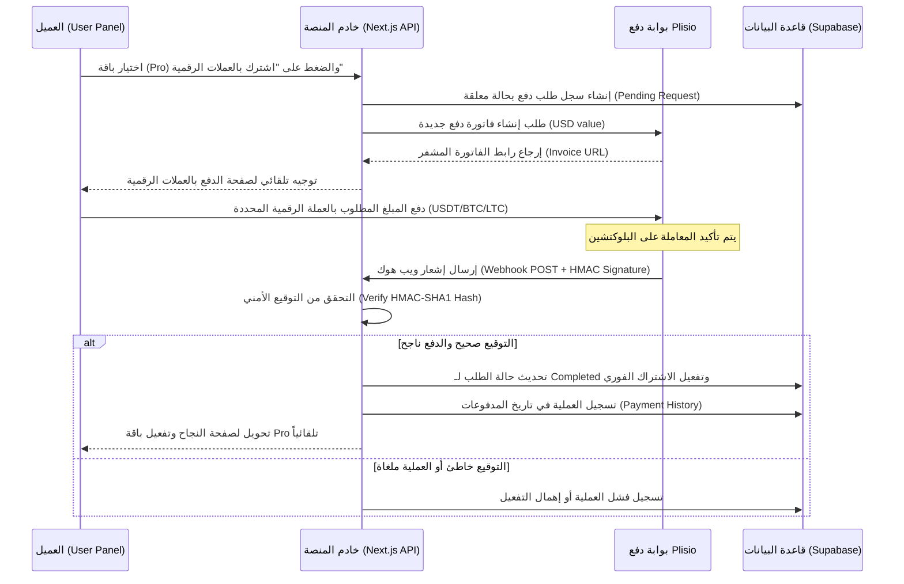

# 🚀 دليل مواصفات ومميزات منصة WaCRM المطورة (نسخة SaaS الاحترافية)

يركز هذا المستند على تفاصيل ومواصفات المنصة البرمجية المطورة حالياً، مع مقارنة تفصيلية بينها وبين النسخة الخام الأصلية المأخوذة من مستودع [ArnasDon/wacrm](https://github.com/ArnasDon/wacrm).

---

## 📋 جدول المحتويات
1. [نظرة عامة على المنصة (SaaS Concept)](#1-نظرة-عامة-على-المنصة-saas-concept)
2. [المميزات التفصيلية للمستخدمين (User Features)](#2-المميزات-التفصيلية-للمستخدمين-user-features)
3. [صلاحيات ومميزات لوحة التحكم للإدارة (Admin Panel)](#3-صلاحيات-ومميزات-لوحة-التحكم-للإدارة-admin-panel)
4. [طرق الربح من المنصة والاشتراكات (Monetization & SaaS Plans)](#4-طرق-الربح-من-المنصة-والاشتراكات-monetization--saas-plans)
5. [الربط بالعملات الرقمية وبوابة الدفع (Crypto & Plisio Integration)](#5-الربط-بالعملات-الرقمية-وبوابة-الدفع-crypto--plisio-integration)
6. [مقارنة تفصيلية: النسخة الأصلية ضد النسخة المطورة الحالية](#6-مقارنة-تفصيلية-النسخة-الأصلية-ضد-النسخة-المطورة-الحالية)

---

## 1. نظرة عامة على المنصة (SaaS Concept)
تعد منصة **WaCRM المطورة** نظام إدارة علاقات عملاء (CRM) متكامل وأتمتة محادثات ذكية مبني للعمل بنموذج **SaaS (البرمجيات كخدمة)**. تتيح للمشروعات والشركات الصغيرة والمتوسطة والأفراد ربط حسابات الواتساب الخاصة بهم وإدارة محادثاتهم مع العملاء بشكل تعاوني، وبناء بوتات رد تلقائي ذكية وأتمتة متطورة بدون كود (No-Code)، مع إمكانية الاشتراك في باقات شهرية أو سنوية والدفع التلقائي بالعملات الرقمية.

---

## 2. المميزات التفصيلية للمستخدمين (User Features)

### 🟢 محرك الاتصال المزدوج بالواتساب (Dual WhatsApp Connection Engine)
* **الاتصال الرسمي (Meta Cloud API):** لمن يمتلك حساب مطورين لدى Meta ويرغب في استخدام الخادم الرسمي وميزات القوالب المعتمدة.
* **الاتصال المباشر (Evolution API):** يتيح ربط الهاتف الشخصي مباشرة عبر **مسح رمز QR Code** دون الحاجة لحساب مطورين، وبدون تكاليف إضافية لكل رسالة من Meta. يقوم النظام بفحص الاتصال بالخلفية كل 5 ثوانٍ لتحديث الحالة وعرض إشارة خضراء عند نجاح الربط.

### 📥 صندوق الوارد المشترك (Shared Inbox)
* لوحة موحدة تضم جميع محادثات الواتساب الواردة.
* إمكانية تعيين المحادثات لأعضاء محددين من الفريق (Agents).
* إضافة ملاحظات داخلية (Private Notes) غير مرئية للعميل لتسهيل التعاون بين الموظفين.
* تغيير حالة المحادثة (نشطة، مغلقة، معلقة) وتصفية الرسائل بناءً عليها.

### 📂 إدارة جهات الاتصال (Contacts CRM)
* حفظ جهات الاتصال وإضافة حقول مخصصة (Custom Fields).
* إسناد وسوم ملونة (Color Tags) للمستخدمين لتصنيفهم بسهولة (مثال: "عميل مهتم"، "VIP").
* استيراد جهات الاتصال عبر ملفات CSV وحل مشكلة تكرار الأرقام تلقائياً (Deduplication).
* تخزين تفاصيل العناوين والبيانات الإضافية.

### 📊 قنوات البيع وكانبان (Sales Pipelines - Kanban Board)
* لوحة تفاعلية لعمليات المبيعات مقسمة إلى مراحل (مثل: مهتم، قيد التواصل، تم البيع، ملغي).
* إمكانية سحب وإفلات الصفقات (Deals) وربط كل صفقة بالمحادثة الخاصة بالعميل على الواتساب للوصول السريع لبيانات العميل وسجل الدردشة.

### 📢 قوالب الرسائل وحملات البث (Broadcasts & Templates)
* **قوالب Meta:** إرسال القوالب الرسمية المعتمدة مع إمكانية إدخال متغيرات وتتبع حالة وصول وقراءة الرسالة.
* **قوالب Evolution API المحلية:** يمكن للعملاء إنشاء قوالب رسائل وتخزينها محلياً في قاعدة البيانات الخاصة بالمنصة وتوظيفها في البث أو الردود بدون قيود Meta.
* **تنسيق بديل تفاعلي للأزرار (Buttons Fallback):** بما أن WhatsApp Web لا يدعم الأزرار الرسومية التفاعلية للبوتات العادية، يقوم النظام برمجياً عبر ملف `evolution-formatter.ts` بتحويل الأزرار إلى صيغة نصية ذكية ومنسقة (باستخدام الإيموجي والأرقام التسلسلية) لضمان وصول الرسالة بنسبة 100% وبشكل احترافي.

### ⚙️ الأتمتة البصرية بدون كود (No-Code Visual Automation Builder)
* منشئ أتمتة متطور يعتمد على السحب والإفلات أو التسلسل الهيكلي.
* **المحفزات (Triggers):** تشغيل الأتمتة عند استقبال رسالة جديدة، احتوائها على كلمات دلالية معينة، تغيير حالة العميل، أو بناءً على جدول زمني.
* **الإجراءات (Actions):** إرسال رسالة واتساب، إسناد وسم، انتظار مهلة زمنية (Wait Step)، إرسال ويب هوك خارجي (Webhook)، إضافة بيانات لـ Google Sheets، أو إنشاء موعد في Google Calendar.

### 🤖 مجيب تلقائي ذكي بالذكاء الاصطناعي (AI Auto-Responder)
* محرك ذكاء اصطناعي مدمج للرد التلقائي على محادثات العملاء وتدريب البوت بمعلومات خاصة بالنشاط التجاري.
* يدعم ربط مفاتيح API الخاصة بـ OpenAI أو DeepSeek.
* البوت يتحقق من باقة العميل؛ حيث تُتاح ميزة تفعيل الرد الآلي للذكاء الاصطناعي لمشتركي باقة **Pro** فقط، لحماية استهلاك الـ API Key الخاص بالعميل وتوفير قيمة مضافة للباقات المدفوعة.

### 🔗 التكامل مع خدمات جوجل (Google Integration)
* **Google Sheets:** إرسال بيانات العملاء والصفقات لملفات جوجل شييتس وتحديثها تلقائياً عند سير المحادثة.
* **Google Calendar:** حجز وتنسيق المواعيد تلقائياً مع العملاء عبر محادثات الواتساب وحفظها في تقويم العميل.

---

## 3. صلاحيات ومميزات لوحة التحكم للإدارة (Admin Panel)

تمتلك المنصة لوحة إدارة شاملة ومخصصة بالكامل على المسار `/admin` تتيح للأدمن ومساعديه إدارة المنصة والتحكم بنشاطها، وتشمل المميزات التالية:

### 📈 لوحة التحليلات والإحصائيات الكلية (Analytics Dashboard)
* مراقبة إجمالي الحسابات المسجلة وحساب معدلات النمو.
* تتبع الاشتراكات النشطة والخطط المجانية.
* حساب الدخل الشهري المتكرر (MRR) ورصد التحليلات المالية بنقرة واحدة.
* عرض آخر المستخدمين المنضمين والأنشطة الإدارية.

### 👥 إدارة المشتركين والعملاء (Accounts & Users Management)
* عرض وتصفية جميع الحسابات المشتركة.
* إمكانية حظر (Block) أو إلغاء حظر أي حساب فورياً لحماية المنصة من الاستخدام العشوائي أو رسائل السبام.
* ترقية مستخدمين عاديين إلى "مساعد إدارة" (Admin Helpers) وتخصيص صلاحياتهم.
* تعديل الاشتراكات يدوياً (ترقية الباقة، تمديد تاريخ انتهاء الصلاحية، تعديل حدود جهات الاتصال أو الرسائل المسموحة).

### 🛡️ مراجعة واعتماد قوالب الرسائل (Pending Templates Review)
* لمنع حظر خوادم المنصة وحمايتها، يمكن للأدمن تفعيل خيار **"مراجعة القوالب"**.
* تظهر لوحة تسمى "القوالب المعلقة" تضم القوالب المحلية التي أنشأها مستخدمو Evolution API.
* يمكن للأدمن **الموافقة (Approve)** ليصبح القالب نشطاً للعميل، أو **الرفض (Reject)** مع كتابة سبب الرفض ليعود القالب للمستخدم كمسودة لتعديله.

### 🎨 لوحة تخصيص الهوية واللاندينج بيج (Branding & Landing Page Customizer)
* تحكم كامل بالاسم التجاري للمنصة وشعارها (Logo URL) والألوان الرئيسية للموقع الرسومي.
* إمكانية تعديل محتويات الصفحة الهبوط (Landing Page) باللغتين العربية والإنجليزية (العنوان الرئيسي، العنوان الفرعي، تفاصيل المميزات، الأسئلة الشائعة FAQs، العبارات التحفيزية CTA) وحفظ التغييرات فوراً لتنعكس على جميع زوار الموقع دون تعديل سطر كود واحد.

### 🎫 نظام الدعم الفني وحل المشاكل (Support Tickets System)
* لوحة متكاملة لاستقبال تذاكر الدعم الفني من العملاء.
* توزيع التذاكر على المساعدين والرد عليها في الوقت الفعلي وتحديث حالتها (مفتوحة، قيد المعالجة، مغلقة) مع دعم المرفقات (صور وفيديو وملفات PDF).

---

## 4. طرق الربح من المنصة والاشتراكات (Monetization & SaaS Plans)

تعتمد المنصة على فكرة بيع باقات الاشتراك كخدمة سحابية متكررة (Monthly/Yearly Subscriptions). 

### 💎 الباقات الافتراضية للربح:
1. **الباقة المجانية (Free Plan):** حدود ضيقة (مثل: 100 جهة اتصال، بوت أتمتة واحد، لا تدعم الذكاء الاصطناعي، اتصال Meta فقط).
2. **الباقة الأساسية (Starter Plan):** حدود متوسطة للشركات الصغيرة.
3. **الباقة الاحترافية (Pro Plan):** وصول غير محدود لجميع المزايا، تفعيل محرك الذكاء الاصطناعي للرد التلقائي، دعم الاتصال المباشر QR Code.

### 💶 قنوات تحصيل الأرباح:
* **الفوترة الذاتية بالعملات الرقمية (Crypto Payments):** تعتمد على بوابة الدفع Plisio التي تحول العميل مباشرة للدفع بعملات متعددة (USDT, BTC, ETH, LTC) وتفعل الباقة فورياً عند استلام التأكيد البرمجي.
* **التفعيل اليدوي عبر تليجرام (Telegram Support Bot):** زر مخصص في لوحة الفوترة يقوم بتحويل العميل إلى بوت تليجرام خاص بالمنصة، لإجراء التحويلات البنكية اليدوية أو المحلية (مثل آسيا حوالة، زين كاش، أو ويسترن يونيون)، حيث يقوم الأدمن بعد استلام الأموال بالدخول للوحة التحكم وترقية العميل يدوياً.

---

## 5. الربط بالعملات الرقمية وبوابة الدفع (Crypto & Plisio Integration)

تمت برمجة الربط المباشر مع بوابة الدفع الشهيرة للعملات الرقمية **Plisio**، وتعمل الدورة البرمجية كالتالي:

### 🔒 الحماية والتحقق من التواقيع الرقمية (Webhook Security):
يحتوي مسار الويب هوك الخاص بـ Plisio في [route.ts](file:///c:/Users/Mustafa/Desktop/wacrm/src/app/api/webhooks/plisio/route.ts) على دالة التحقق الرقمية `verifyPlisioSignature`. تقوم هذه الدالة بتجميع خصائص الطلب الوارد وفرز مفاتيحها أبجدياً (ksort) ثم توليد تشفير SHA1 باستخدام رمز المتغير البيئي `PLISIO_SECRET_KEY` ومقارنتها بالـ Hash الوارد من خوادم Plisio. هذا يضمن حماية المنصة بنسبة 100% من محاولات التلاعب أو تزوير طلبات الدفع.

---

## 6. مقارنة تفصيلية: النسخة الأصلية ضد النسخة المطورة الحالية

| وجه المقارنة | النسخة الخام الأصلية (ArnasDon/wacrm) | النسخة المطورة الحالية (SaaS & Multi-Tenant) |
| :--- | :--- | :--- |
| **طبيعة المنصة الأساسية** | مشروع CRM ذو طابع شخصي أو فردي ومفتوح المصدر (Self-Host CRM). | نظام SaaS تجاري متعدد الشركات والاشتراكات (Multi-Tenant SaaS Ready). |
| **محرك اتصال واتساب** | يدعم فقط الاتصال الرسمي عبر Meta Cloud API (يتطلب حساب مطورين و WABA ID). | يدعم المحرك المزدوج: Meta API الرسمي + الاتصال المباشر (Evolution API) عبر مسح الـ **QR Code** من شاشة التحكم مباشرة. |
| **بوابة الدفع والاشتراكات** | لا توجد أي بوابات دفع، ولا يوجد منطق اشتراكات أو فوترة. | نظام اشتراكات متكامل مدمج ببوابة العملات الرقمية **Plisio** + إمكانية الربط التلقائي عبر بوت تليجرام للتفعيل اليدوي. |
| **صلاحيات لوحة الإدارة** | لا تحتوي على لوحة تحكم عامة للأدمن لإدارة المستخدمين أو الإعدادات العامة. | لوحة إدارة كاملة (/admin) للتحكم بالحسابات، تفعيل/إلغاء حظر العملاء، وتعديل خطط اشتراكاتهم يدوياً. |
| **تخصيص الهوية واللاندينج** | الهوية ثابتة ويتم تعديلها برمجياً فقط عبر تعديل الكود المصدري للموقع. | لوحة إعدادات للأدمن لتعديل اسم المنصة وشعارها وألوانها ونصوص الصفحة الهبوط والأسئلة الشائعة من المتصفح مباشرة وتخزينها بقاعدة البيانات. |
| **مراجعة قوالب الرسائل** | قوالب الرسائل ترسل مباشرة لـ Meta للمراجعة والقبول، ولا توجد مراجعة محلية. | نظام مراجعة داخلي وقسم مخصص للأدمن للموافقة/الرفض على القوالب المحلية المنشأة عبر اتصال Evolution لضبط الأمان. |
| **الدعم الفني المدمج** | لا يوجد أي نظام تذاكر دعم فني مدمج للتواصل مع العملاء. | نظام دعم فني متكامل (Support Tickets) يتيح للعملاء رفع المشاكل مع المرفقات والمستندات ويتيح للأدمن ومساعديه الرد عليها. |
| **الذكاء الاصطناعي (AI)** | لا يوجد نظام مدمج للرد التلقائي عبر الذكاء الاصطناعي والتعلم. | محرك ذكاء اصطناعي للرد التلقائي (OpenAI / DeepSeek) مقيد بالاشتراك بالباقة الاحترافية (Pro). |
| **حماية RLS والرقابة** | RLS بسيط مبني على أدوار الفريق والحسابات. | حماية أمنية مشددة (RLS) تم تعديلها لربط مميزات وخصائص المنصة بنوع الاشتراك وتفعيل حظر وحجب الوصول الفوري للمخالفين. |

---

## 🛠️ كيف يستفيد الأدمن من المنصة للربح؟
1. **الاشتراك التلقائي:** رفع المنصة للجمهور وتسويق باقة **Pro** للشركات التي تبحث عن ربط هاتفها الشخصي بالواتساب بدون توثيق شركة وبدون دفع مصاريف إضافية لفيسبوك.
2. **استقبال الأرباح بالعملات الرقمية:** يستلم الأدمن الأرباح مباشرة على محفظته الخاصة المربوطة بـ Plisio بفضل المعالجة المباشرة والآمنة للمدفوعات.
3. **توفير دعم فني متميز:** من خلال نظام تذاكر الدعم، يقدم المساعدون إجابات سريعة للعملاء وحل المشاكل مباشرة من داخل التطبيق مما يرفع من جودة وتقييم الخدمة.
4. **مرونة العرض والتسويق:** تحديث نصوص اللاندينج بيج والألوان للتماشى مع المواسم التسويقية دون الحاجة لمطورين وبنقرة زر واحدة.
